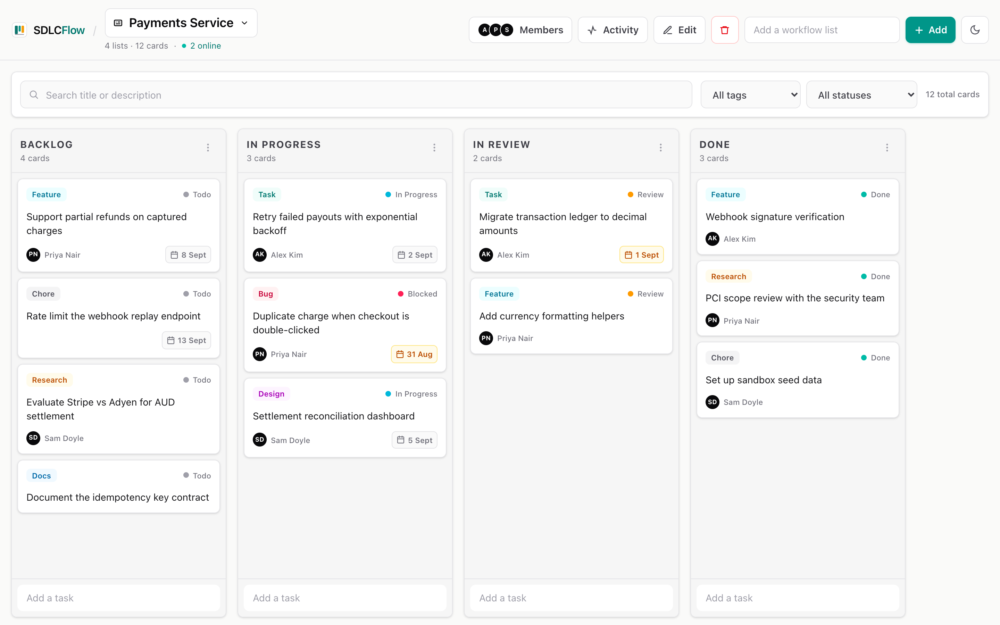
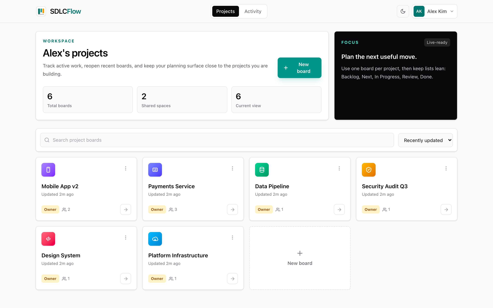
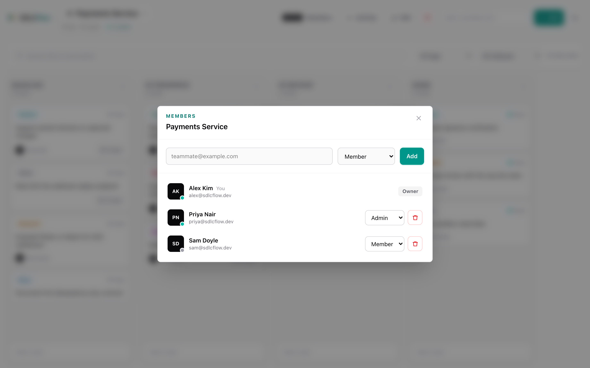
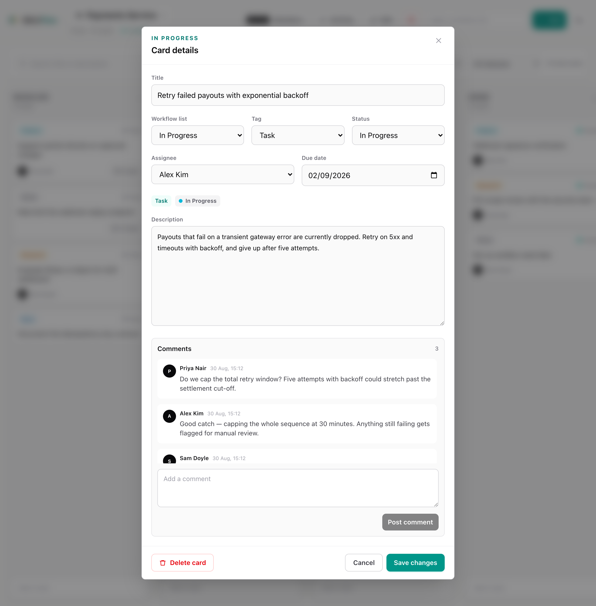
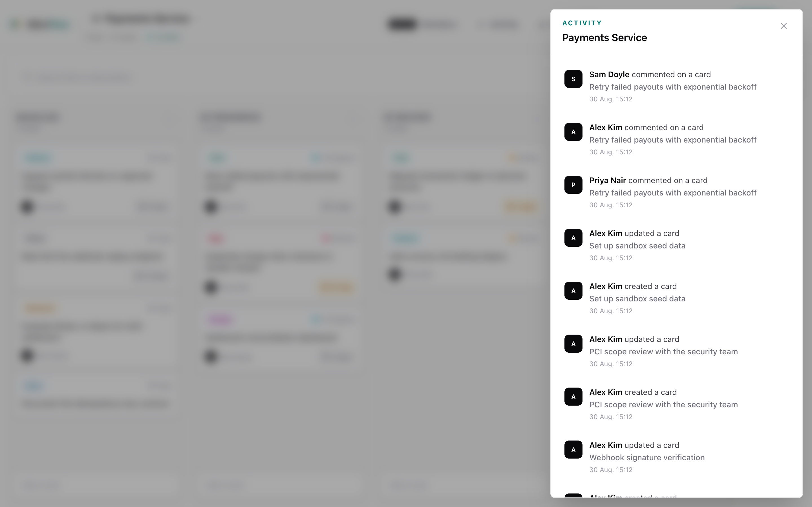
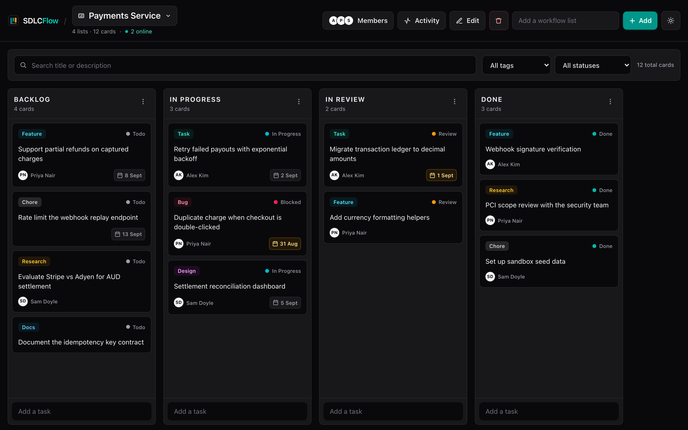
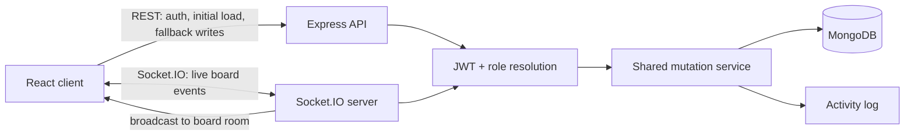
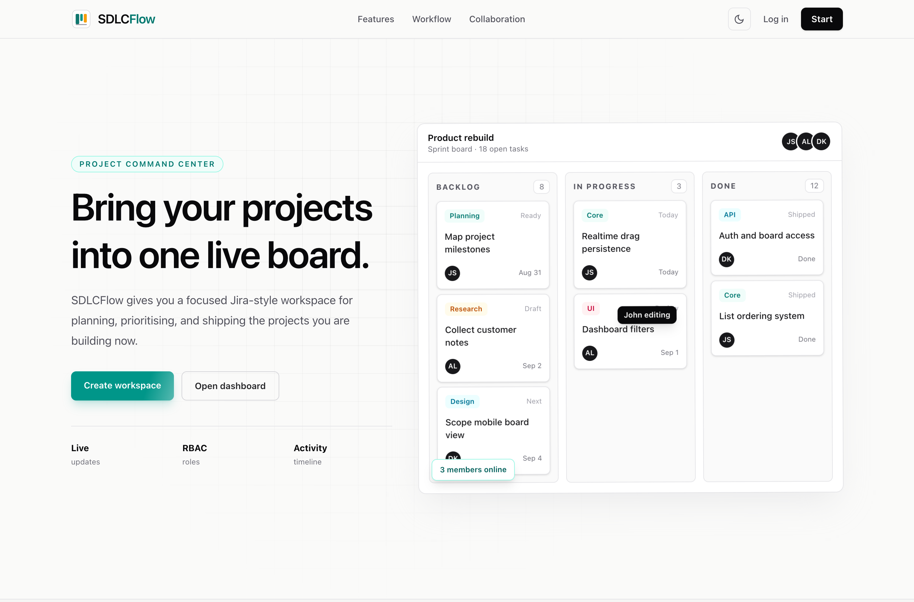

<div align="center">


# SDLCFlow

**A real-time project board for software teams — plan work, move it across the lifecycle, and watch your teammates do the same, live.**


</div>

---

## The problem

A Kanban board is easy to build and hard to build *well*. The moment two people
open the same board, the interesting questions start: who is allowed to move this
card, what happens when both of them drag it at once, how does the second browser
find out, and what does the app do when the connection drops mid-drag?

SDLCFlow is a full-stack project board built around those questions rather than
around the CRUD. Every mutation is authorised on the server, persisted, recorded
in an activity log, acknowledged to the sender, and broadcast to everyone else on
the board — over WebSockets, in that order.

<div align="center">



</div>

---

## Features

### One board per project, lists for the states work moves through

Boards carry a name, one of ten engineering icons, and a colour, so a workspace of
six projects stays readable. Inside a board, lists are the workflow states and
cards are the work. Both drag with [dnd-kit](https://dndkit.com) and both persist
their new order the moment you drop them — optimistically, with a rollback and a
toast if the server disagrees.

Ordering uses fractional positions, so moving one card writes one document
instead of renumbering the column.

New projects can start blank or from a software-focused workflow template.
SDLCFlow ships with starter workflows for sprints, GitHub-style issue tracking,
bug triage, roadmaps, personal development, and release planning. Templates seed
the starter workflow's lists and cards server-side, so setup is one reliable
request instead of a chain of client-side creates.

<div align="center">



</div>

### Live collaboration, not polling

Open the same board in two browsers and the second one keeps up. Card and list
creates, edits, moves, deletes, comments, and board chat messages all travel over
Socket.IO, and the header shows who else is currently looking at the board.

The handshake is where authorisation starts, not where it is bolted on:

1. The JWT is verified **during** the Socket.IO handshake — an unauthenticated
   socket never reaches a room or an event handler.
2. `board:join` re-checks membership for that specific board. Proving who you are
   is not the same as proving you belong here.
3. Every mutating event checks the caller's board role before touching anything.
4. The change is persisted, then recorded as activity.
5. The sender gets an ack carrying the saved document.
6. The board room gets the broadcast, sender excluded.

Presence is tracked per user rather than per socket — three tabs is still one
person online — and broadcasts are throttled by 500 ms so a refresh doesn't spray
the room with near-identical member lists.

Losing the socket degrades rather than breaks: every mutation goes through a
`realtimeOrRest` helper that falls back to the equivalent REST call, so you can
keep working offline-of-the-socket and the board re-fetches on reconnect rather
than trusting stale local state.

### Roles that the server actually enforces

Hiding a button is a nicety; the API is where permission is decided. Every REST
handler and every socket event resolves the caller's role on that board first,
and non-members get a `404` rather than a `403`, so a private board never
confirms its own existence to a stranger.

| | Member | Admin | Owner |
|---|:---:|:---:|:---:|
| View the board, its activity and members | ✅ | ✅ | ✅ |
| Create, edit, move and delete lists and cards | ✅ | ✅ | ✅ |
| Comment on cards | ✅ | ✅ | ✅ |
| Rename the board, change its icon and colour | — | ✅ | ✅ |
| Add and remove members | — | ✅ | ✅ |
| Promote a member to admin | — | — | ✅ |
| Delete the board | — | — | ✅ |

<div align="center">



</div>

The dots on each avatar are live presence — teal for the two people on the board
right now, grey for the one who isn't.

### Cards carry the metadata a software task needs

A card opens into a detail view with a description, a workflow list, one of seven
tags (Task, Feature, Bug, Design, Research, Docs, Chore), one of five statuses
(Todo, In Progress, Review, Blocked, Done), an assignee, and a due date. Due dates
turn amber as they approach.

Assignees are validated against board membership on the server, so a card can't be
assigned to someone who can't open it.

Comments are realtime too — post one and it appears in every other open copy of
that card, and lands in the board's activity feed.

<div align="center">



</div>

### An activity trail for everything

Every create, update, move, delete, comment, and membership change is written to
an activity log as it happens. Read it per board from the board's own panel, or
across every board you belong to at `/activity`.

<div align="center">



</div>

### Board chat for project conversation

Every board has its own realtime chat drawer. Messages are persisted to MongoDB,
loaded over REST when the drawer opens, and sent over Socket.IO when connected
with REST fallback when the socket is unavailable. Only board members can read or
send messages. The board header shows an unread badge while the drawer is
closed, messages are grouped by day, and the composer supports Enter to send
with Shift+Enter for multiline notes. Typing indicators show when another board
member is writing. People can delete their own messages, and owners can clear a
board's chat when a project conversation needs a reset. If a send fails, the
message stays in the thread with a retry action instead of disappearing.

### Search, filters, and a dark mode that isn't an afterthought

Boards filter by name and sort by recent activity, creation date, or name. Cards
filter by title, description, tag, and status, with the counts updating as you
type. The theme follows your OS by default and is remembered once you override it.

<div align="center">



</div>

### Account management

Profile editing, password changes with the current password required, workspace
statistics, and account deletion that cleans up the personal data it leaves
behind.

---

## Architecture



The decision worth pointing at: **REST and Socket.IO mutations run through the
same service layer.** A card update gets identical validation, permission checks,
persistence, activity logging, and response shape whether it arrived as an HTTP
`PATCH` or a live socket event. The transport changes; the rules don't.

---

## Running it locally

You need Node 20+ and a MongoDB connection string (a free Atlas cluster is fine).

```bash
git clone https://github.com/qadeerdev12/SDLCFlow.git
cd SDLCFlow
```

Server:

```bash
cd server && npm install && cp .env.example .env && npm run dev
```

Client, in a second terminal:

```bash
cd client && npm install && cp .env.example .env && npm run dev
```

The client runs on `http://localhost:5173` and the API on `http://localhost:5050`.

<div align="center">



</div>

Register two accounts in two browsers, add the second one to a board from the
members panel, and drag a card — that is the whole feature in one gesture.

### Environment variables

**`server/.env`**

| Variable | Required | Purpose |
|---|:---:|---|
| `MONGO_URI` | yes | MongoDB connection string |
| `JWT_SECRET` | yes | Secret used to sign and verify tokens |
| `PORT` | no | HTTP and Socket.IO port. Defaults to `5050` |
| `CLIENT_ORIGIN` | no | Comma-separated allowed browser origins |

**`client/.env`**

| Variable | Required | Purpose |
|---|:---:|---|
| `VITE_API_URL` | no | REST base URL. Defaults to `http://localhost:5050/api/v1` |
| `VITE_SOCKET_URL` | no | Socket.IO URL. Defaults to `http://localhost:5050` |

---

## Tests

```bash
cd server && npm test
```

Seventeen integration tests run against an in-memory MongoDB and a real Socket.IO
server — no mocks standing in for the parts most likely to be wrong. They cover
the permission matrix above, the handshake rejecting invalid JWTs, membership
being checked before a room join, broadcasts reaching collaborators while acking
the sender, assignee validation, template board creation, comment/chat scoping,
and account deletion.

Client checks:

```bash
cd client && npm run lint && npm run build
```

---

## Project structure

```text
client/src/
  components/   board columns, cards, panels, modals
  context/      auth, theme, toast providers
  hooks/        useSocket — the client's Socket.IO lifecycle
  lib/          API client, board colours and icons, card metadata
  pages/        landing, auth, dashboard, board, activity, profile

server/src/
  controllers/  REST handlers
  data/         read-only workflow template catalog
  services/     shared mutation, chat and activity logic
  socket.js     handshake auth, rooms, presence, board events, chat events
  models/       User, Board, List, Card, Comment, Message, Activity
  utils/        board access and role resolution
```

---

## Documentation

| Doc | What's in it |
|---|---|
| [Product requirements](docs/01-PRD.md) | Goals, users, scope, acceptance criteria |
| [System design](docs/02-system-design.md) | Architecture and the trade-offs behind it |
| [Data model](docs/03-data-model.md) | Collections, relationships, embed-vs-reference decisions |
| [API specification](docs/04-api-spec.md) | REST endpoints and the Socket.IO event contract |
| [Sprint plan](docs/05-sprint-plan.md) | Process, backlog, milestones, definition of done |
| [Realtime architecture](docs/06-realtime-architecture.md) | Socket implementation notes and maintenance guide |

---

## Known limitations

**Adding a member requires them to have an account already.** You invite by
email, and the server looks that email up. There is no email invitation flow yet.

**Reconnecting re-fetches the board rather than replaying what it missed.** It is
correct and simple, and it costs one extra request after a dropped connection.
Event replay is on the backlog.

**One server instance.** Socket.IO rooms live in that process's memory, so running
two instances behind a load balancer would split the rooms. Fixing that is a Redis
adapter, deliberately deferred until there is a reason to scale horizontally.

**Fractional positions have no rebalance job.** Repeatedly dropping a card into
the same gap will eventually exhaust float precision. Thousands of moves away, but
real.

**JWTs last seven days with no refresh token.** Logging out clears the token
client-side; it stays valid server-side until it expires.

**Not deployed yet.** It runs locally against Atlas; Vercel and Render are the
intended hosts and the environment variables above are already wired for them.

---

## Licence

MIT
