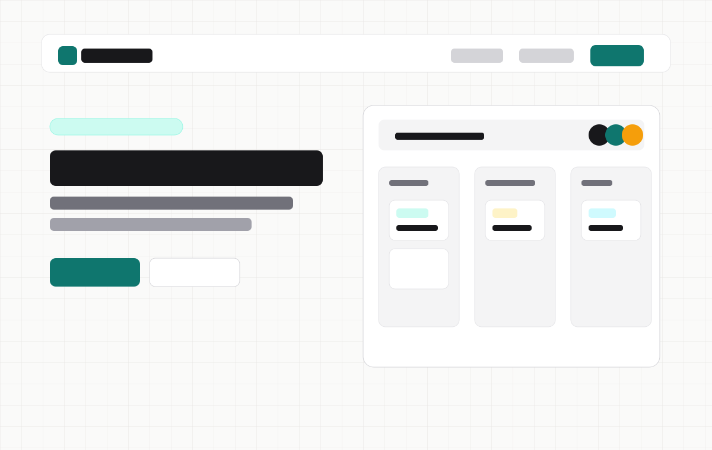
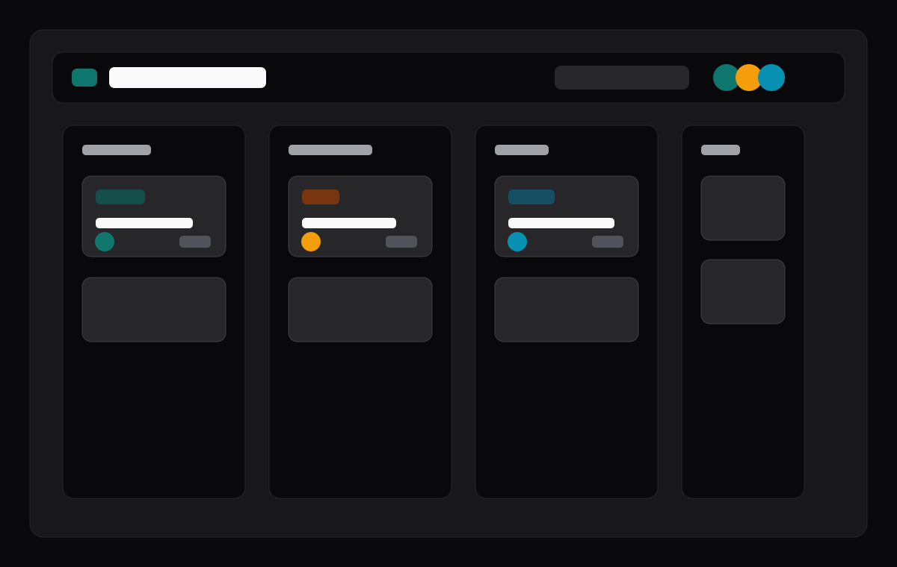
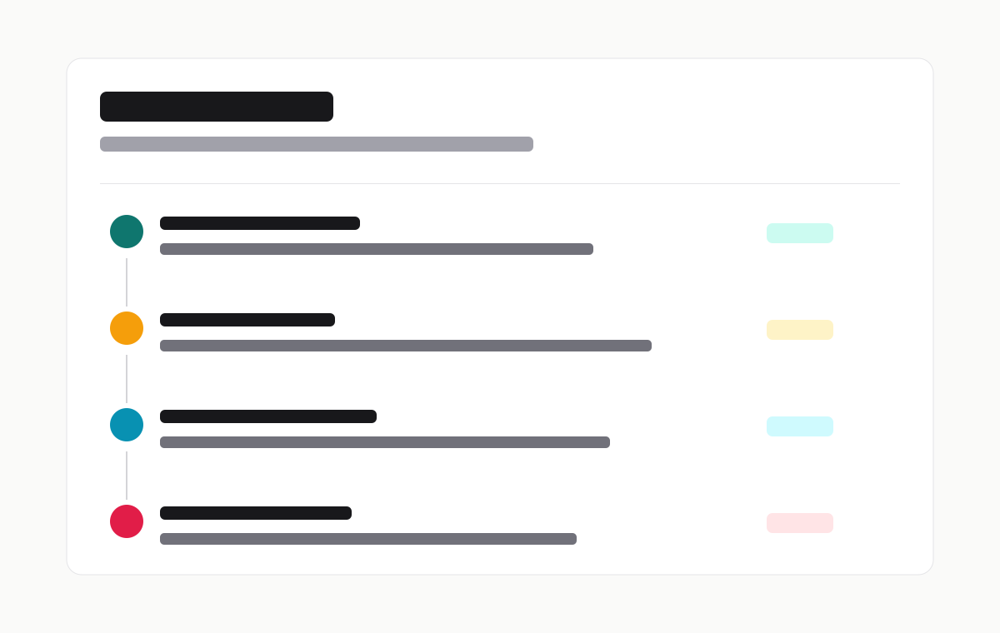
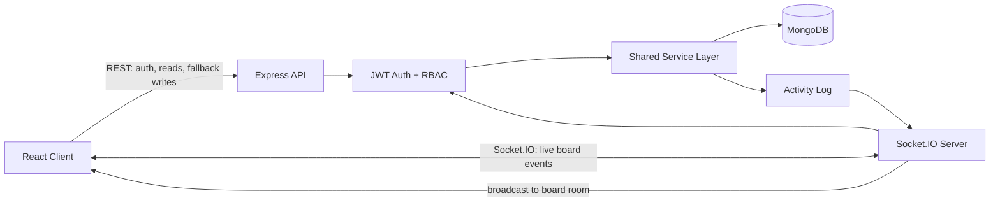

# SDLCFlow

**SDLCFlow** is a real-time software project management app for planning, tracking, and shipping work across the software development lifecycle. It combines a focused Jira-style board with live collaboration, role-based access control, activity tracking, and rich task metadata.

Built as a full-stack portfolio project, SDLCFlow is designed to show more than CRUD: authenticated realtime systems, shared mutation logic, permission enforcement, data modelling, and polished product UX.

<p align="center">
  
</p>

## Highlights

- **Realtime boards** with Socket.IO rooms, authenticated socket handshakes, live card/list updates, and reconnect recovery.
- **Software-focused task flow** with lists, cards, descriptions, comments, tags, statuses, assignees, and due dates.
- **Board management** for creating, renaming, deleting, and visually identifying boards with tech-oriented icons and colors.
- **Role-based collaboration** with owner, admin, and member permissions enforced across REST and WebSocket mutations.
- **Activity tracking** through global and board-specific timelines, including realtime activity events.
- **Professional dashboard UX** with search, tag/status filters, empty states, loading states, toast notifications, dark mode, and responsive layouts.
- **Account controls** with profile editing, password changes, workspace statistics, and account deletion.

## Screenshots

| Landing Page | Project Board | Activity Timeline |
|---|---|---|
|  |  |  |

Replace these previews with final production captures after deployment:

- Landing page showing SDLCFlow branding and feature messaging.
- Board page with realtime presence, cards, tags, statuses, assignees, and due dates.
- Card detail modal with description and comments.
- Activity page showing recent board updates.

## Tech Stack

| Layer | Technology |
|---|---|
| Client | React, Vite, Tailwind CSS |
| Routing | React Router |
| Drag and drop | dnd-kit |
| Realtime | Socket.IO |
| Server | Node.js, Express |
| Database | MongoDB, Mongoose |
| Auth | JWT |
| Testing | Vitest, Supertest, mongodb-memory-server |
| Deployment target | Vercel, Render, MongoDB Atlas |

## Architecture



The key design decision is that REST and Socket.IO mutations share the same service layer. A card update follows the same validation, permission checks, persistence, activity logging, and response shape whether it came from HTTP or a live socket event.

## Realtime Model

Every realtime mutation follows this flow:

1. Verify the Socket.IO JWT during connection.
2. Verify board membership before joining `board:<boardId>`.
3. Enforce the required board role for mutations.
4. Persist the card/list/member change.
5. Record activity.
6. Ack the sender with the saved document.
7. Broadcast the saved event to the board room, excluding the sender.

Presence is tracked per board and throttled before broadcasting, so viewers can see who is actively working without noisy connect/disconnect storms.

## Project Structure

```text
client/
  src/
    components/      shared UI components
    context/         auth, theme, and toast providers
    hooks/           client hooks, including useSocket
    lib/             API client, board colors/icons, card metadata helpers
    pages/           route-level screens

server/
  src/
    config/          database setup
    controllers/     REST route handlers
    middleware/      auth middleware
    models/          Mongoose models
    routes/          Express routers
    services/        shared mutation and activity logic
    socket.js        Socket.IO auth, rooms, presence, and events

docs/
  01-PRD.md
  02-system-design.md
  03-data-model.md
  04-api-spec.md
  05-sprint-plan.md
  06-realtime-architecture.md
```

## Local Development

Install dependencies separately for the server and client:

```bash
cd server
npm install
npm run dev
```

```bash
cd client
npm install
npm run dev
```

Default local URLs:

| App | URL |
|---|---|
| Client | `http://localhost:5173` |
| Server | `http://localhost:5050` |

## Environment Variables

Create local env files from the examples:

```bash
cp server/.env.example server/.env
cp client/.env.example client/.env
```

Server:

| Variable | Required | Purpose |
|---|---:|---|
| `PORT` | No | HTTP and Socket.IO server port. Defaults to `5050`. |
| `MONGO_URI` | Yes | MongoDB connection string. |
| `JWT_SECRET` | Yes | Secret used to sign and verify JWTs. |
| `CLIENT_ORIGIN` | No | Comma-separated list of allowed browser origins. |

Client:

| Variable | Required | Purpose |
|---|---:|---|
| `VITE_API_URL` | No | REST API base URL. Defaults to `http://localhost:5050/api/v1`. |
| `VITE_SOCKET_URL` | No | Socket.IO server URL. Defaults to `http://localhost:5050`. |

## Verification

Run these before opening a PR or deploying:

```bash
cd client
npm run lint
npm run build
```

```bash
cd server
npm test
```

The server test suite uses an in-memory MongoDB instance plus a local Socket.IO server to verify permissions and realtime board events.

## Deployment Notes

Recommended production split:

| Piece | Host |
|---|---|
| Client | Vercel |
| Server | Render |
| Database | MongoDB Atlas |

Render server environment:

```text
MONGO_URI=<atlas connection string>
JWT_SECRET=<long random secret>
CLIENT_ORIGIN=https://<your-vercel-app>.vercel.app
```

Vercel client environment:

```text
VITE_API_URL=https://<your-render-service>.onrender.com/api/v1
VITE_SOCKET_URL=https://<your-render-service>.onrender.com
```

After changing Vercel environment variables, redeploy the client so Vite bakes the new values into the production build.

## Documentation

| Doc | Purpose |
|---|---|
| [Product Requirements](docs/01-PRD.md) | Product goals, users, scope, and acceptance criteria |
| [System Design](docs/02-system-design.md) | Architecture, trade-offs, and realtime design |
| [Data Model](docs/03-data-model.md) | MongoDB collections, relationships, and modelling decisions |
| [API Specification](docs/04-api-spec.md) | REST endpoints and Socket.IO event contracts |
| [Sprint Plan](docs/05-sprint-plan.md) | SDLC process, backlog, milestones, and definition of done |
| [Realtime Architecture](docs/06-realtime-architecture.md) | Socket.IO implementation notes and maintenance guide |

## Roadmap

- Production deployment on Vercel, Render, and MongoDB Atlas.
- Supabase Auth integration.
- Final production screenshots and demo GIF.
- Optional AI project assistant for natural-language project commands.

## License

MIT
