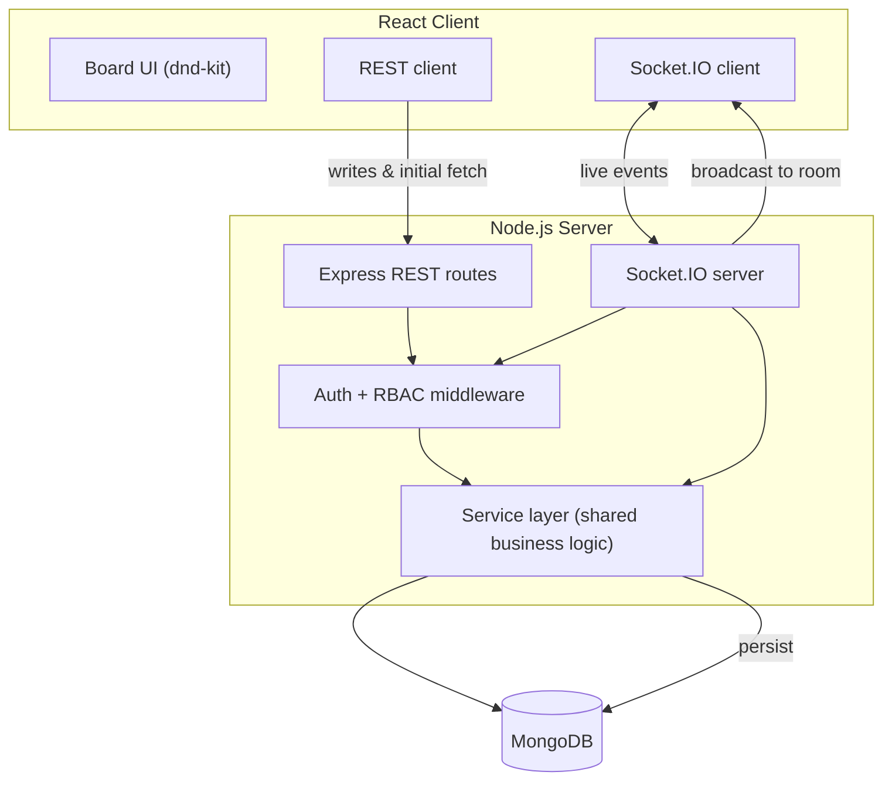
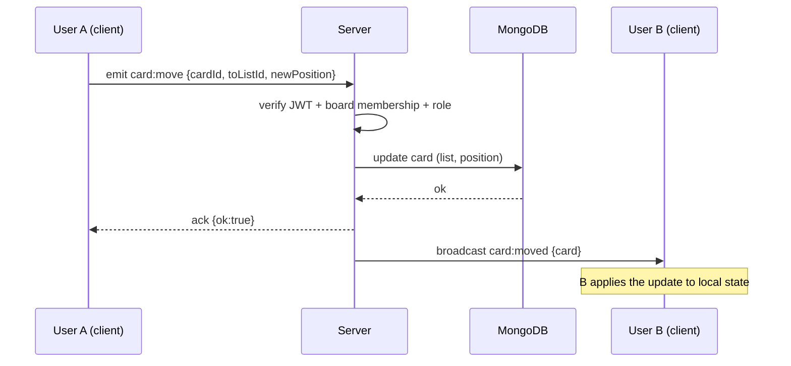

# 02 — System Design

**Project:** SDLCFlow
**Status:** Draft v1.0

This document captures the architecture and the design decisions that matter. It is deliberately honest about constraints: the goal is a well-reasoned MVP, **not** a production-perfect distributed system. Where something is simplified for MVP, the "what we'd do at scale" version is noted so the trade-off is explicit.

---

## 1. Architecture overview

SDLCFlow is a three-tier app: a React client, a Node API server that exposes **both** a REST API and a Socket.IO server, and a MongoDB database.



**Key principle:** REST and Socket.IO share a single **service layer**. Whether a card is moved via an HTTP request or a socket event, it goes through the same validation, permission check, and persistence code. This avoids two divergent code paths and is the cleanest way to keep authorization consistent.

---

## 2. Why REST *and* WebSockets (not just one)

- **REST** handles request/response work: login, initial board load, and writes where the client wants a clear success/failure (create board, delete card).
- **Socket.IO** handles the live fan-out: once a write is persisted, every *other* client on that board needs to hear about it.

A common junior mistake is to do *everything* over sockets. Using REST for the initial load and definitive writes keeps things debuggable and cache-friendly; sockets carry the incremental deltas. This separation is a deliberate design choice, not an accident.

---

## 3. Real-time model

### Rooms
Each board maps to one Socket.IO **room**, keyed by `board:<boardId>`. When a client opens a board, it emits `board:join`; the server verifies membership and joins the socket to that room. Broadcasts are scoped to the room, so a user never receives events for boards they aren't viewing or authorised for.

### Write → persist → broadcast
The cardinal rule: **the database is the source of truth, and we broadcast only after a successful write.**



If the write fails, the server NACKs the originating client and broadcasts nothing — so clients never diverge from the database on a failed op.

### Reconnection
The client auto-reconnects (Socket.IO default). On reconnect it **re-fetches the board over REST** and replaces local state, rather than trying to replay missed events. This is simpler and correct; event replay is a stretch goal.

---

## 4. Optimistic UI

For a snappy feel, the client applies a drag **optimistically** (move the card immediately in local state), then sends the event. On `ack:ok` it keeps the change; on NACK or timeout it **rolls back** to the last server-confirmed state. The broadcast to *other* users only happens after persistence, so other users never see a move that didn't actually commit.

---

## 5. The hard part: card & list ordering under concurrency

Drag-and-drop reordering is the trickiest correctness problem here, so it gets its own section.

### The naive approach (and why it's bad)
Storing `position` as a sequential integer (`0,1,2,3…`) means inserting a card between positions 1 and 2 forces you to re-number every following card — many writes, and a race magnet when two users reorder at once.

### The chosen approach: fractional positioning
Store `position` as a **float**. To insert between two cards, set the new position to the **midpoint** of its neighbours:

```
between 1.0 and 2.0  ->  1.5
between 1.0 and 1.5  ->  1.25
```

Inserting becomes a single-document update — O(1), no re-numbering, and concurrent inserts in different spots don't collide.

### Known limitation + mitigation
Repeated midpoint inserts in the same gap eventually exhaust float precision. **Mitigation:** when the gap between neighbours drops below a threshold, run a cheap "re-balance" that re-spaces that list's cards (`10, 20, 30…`). At MVP scale this almost never triggers. (The production-grade version of this idea is *lexicographic ranking* / LexoRank, using string keys instead of floats — noted as a future improvement, not built now.)

### Concurrency policy
MVP uses **last-write-wins**: if two users move the same card simultaneously, the later persisted write is the final state, and both clients converge on it via the broadcast. This is acceptable and documented; true conflict-free merging (CRDTs) is explicitly out of scope.

---

## 6. Authentication & authorization

### Authentication
- Email/password; passwords hashed with **bcrypt**.
- On login the server issues a **JWT access token** (short-lived). The client stores it and sends it as `Authorization: Bearer <token>` on REST calls and in the **socket handshake auth payload**.
- Socket connections are rejected at the handshake if the token is missing/invalid — unauthenticated sockets never connect.

### Authorization (RBAC)
Three roles per board, checked on **every** state-changing operation:

| Action | Owner | Admin | Member |
|---|:---:|:---:|:---:|
| View board | ✅ | ✅ | ✅ |
| Create / move / edit cards & lists | ✅ | ✅ | ✅ |
| Add / remove members | ✅ | ✅ | ❌ |
| Change member roles | ✅ | ❌ | ❌ |
| Delete board | ✅ | ❌ | ❌ |

**Critical rule:** permissions are enforced **server-side on both REST and socket events**, not just hidden in the UI. Hiding a button is UX; the server check is security. Both layers call the same `requireRole(boardId, minRole)` guard in the service layer.

---

## 7. Scaling considerations (documented, not built)

The MVP runs as a **single server instance**. That is fine for a demo but would break under real load. Honest notes on what breaks and the fix:

| Bottleneck | Why it breaks at scale | Production fix (future) |
|---|---|---|
| In-memory Socket.IO rooms | Multiple server instances don't share room state, so a broadcast from instance A never reaches a client on instance B | **Socket.IO Redis adapter** to fan out across instances |
| Sticky sessions | A reconnecting socket may hit a different instance | Load balancer with sticky sessions, or stateless handshake + Redis |
| Unbounded board reads | Loading huge boards is slow | Pagination / lazy-load cards per list; proper indexes (see data-model) |
| Float position precision | Pathological re-inserts | Lexicographic ranking (LexoRank) |

This table is the point of the exercise: showing awareness of the limits is what an interviewer wants, even when the MVP doesn't implement the fixes.

---

## 8. Security checklist

- Passwords hashed (bcrypt), never stored or logged in plaintext.
- JWT secret in env vars; never shipped to client.
- All input validated server-side (e.g. with `zod`/`express-validator`) — never trust the client.
- Authorization re-checked server-side on every mutation (REST + socket).
- CORS locked to the known front-end origin.
- Basic rate limiting on auth endpoints to slow brute force.
- No sensitive data in URLs or query strings.

---

## 9. Trade-offs summary

| Decision | Chosen | Alternative | Why chosen |
|---|---|---|---|
| Conflict handling | Last-write-wins | CRDT / operational transform | Far simpler; acceptable for MVP scope |
| Reconnect | Re-fetch state | Event replay/queue | Simpler and correct; replay is a stretch |
| Ordering | Fractional float + rebalance | Integer re-index / LexoRank | O(1) inserts, low complexity |
| Transport | REST + Socket.IO | All-sockets | Debuggable, cache-friendly initial load |
| Data shape | Reference lists/cards | Embed everything in board doc | Avoids large-document write contention (see data-model) |

---

## 10. Open questions (revisit during build)
- Access-token-only vs adding refresh tokens? (MVP: access token only; refresh is stretch.)
- Should list reordering use the same fractional scheme as cards? (Yes — reuse the logic.)
- Where to draw the presence-update frequency line to avoid event spam? (Throttle presence pings.)
