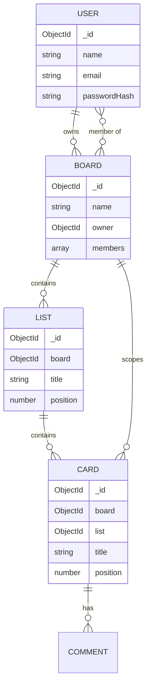

# 03 — Data Model

**Project:** CollabBoard
**Database:** MongoDB (Mongoose)
**Status:** Draft v1.0

---

## 1. Modelling approach

MongoDB lets you embed or reference. The decision here:

- **Reference** lists and cards as separate collections (not embedded in the board document).

**Why not embed everything in one board document?** A board with many cards would become a large document that every card move rewrites, creating write contention and hitting document size limits over time. Separate collections let a single card update touch a single small document — which is exactly what high-frequency drag-and-drop needs.

- **Embed** small, bounded, owned data: board membership lives inside the board document (a board has few members, and they're always read with the board).

This "embed what's small and read-together, reference what's large and written-independently" rule is the core data-modelling decision and is worth being able to explain.

---

## 2. Entity relationships



---

## 3. Collections

### 3.1 `users`

| Field | Type | Notes |
|---|---|---|
| `_id` | ObjectId | PK |
| `name` | String | required |
| `email` | String | required, unique, lowercased |
| `passwordHash` | String | bcrypt hash, **never** returned in API responses |
| `createdAt` / `updatedAt` | Date | timestamps |

```json
{
  "_id": "u_1",
  "name": "Qadeer Afzal",
  "email": "qadeer@example.com",
  "passwordHash": "$2b$10$...",
  "createdAt": "2026-06-01T10:00:00Z"
}
```

---

### 3.2 `boards`
Membership is **embedded** (small, always read with the board).

| Field | Type | Notes |
|---|---|---|
| `_id` | ObjectId | PK |
| `name` | String | required |
| `owner` | ObjectId → User | the creator |
| `members` | Array<Member> | embedded subdocuments |
| `members[].user` | ObjectId → User | |
| `members[].role` | String enum | `owner` \| `admin` \| `member` |
| `createdAt` / `updatedAt` | Date | timestamps |

```json
{
  "_id": "b_1",
  "name": "Q3 Roadmap",
  "owner": "u_1",
  "members": [
    { "user": "u_1", "role": "owner" },
    { "user": "u_2", "role": "admin" },
    { "user": "u_3", "role": "member" }
  ]
}
```

---

### 3.3 `lists`

| Field | Type | Notes |
|---|---|---|
| `_id` | ObjectId | PK |
| `board` | ObjectId → Board | required, indexed |
| `title` | String | required |
| `position` | Number (float) | fractional ordering (system-design §5) |
| `createdAt` / `updatedAt` | Date | timestamps |

```json
{ "_id": "l_1", "board": "b_1", "title": "To Do", "position": 1.0 }
```

---

### 3.4 `cards`

| Field | Type | Notes |
|---|---|---|
| `_id` | ObjectId | PK |
| `board` | ObjectId → Board | required, indexed (scopes all queries) |
| `list` | ObjectId → List | required, indexed |
| `title` | String | required |
| `description` | String | optional |
| `tag` | String | enum: Task, Feature, Bug, Design, Research, Docs, Chore |
| `status` | String | enum: Todo, In Progress, Review, Blocked, Done |
| `position` | Number (float) | fractional ordering within its list |
| `assignee` | ObjectId → User | optional; must reference a board member |
| `dueDate` | Date | optional |
| `createdAt` / `updatedAt` | Date | timestamps |

```json
{
  "_id": "c_1",
  "board": "b_1",
  "list": "l_1",
  "title": "Wire up Socket.IO rooms",
  "description": "Join board room on open, verify membership",
  "tag": "Feature",
  "status": "In Progress",
  "assignee": "u_2",
  "dueDate": "2026-09-02T00:00:00.000Z",
  "position": 1.5,
}
```

> **Note:** `card.board` is stored even though the card belongs to a list, because nearly every query and permission check is scoped by board. Denormalising `board` onto the card avoids an extra lookup on the hot path.

---

### 3.5 `comments` *(stretch)*

| Field | Type | Notes |
|---|---|---|
| `_id` | ObjectId | PK |
| `card` | ObjectId → Card | indexed |
| `author` | ObjectId → User | |
| `body` | String | required |
| `createdAt` | Date | |

---

### 3.6 `activities` *(stretch)*
Append-only log for the activity feed: `{ board, actor, type, meta, createdAt }`.

---

## 4. Indexes

| Collection | Index | Reason |
|---|---|---|
| `users` | `{ email: 1 }` unique | login lookup, enforce uniqueness |
| `boards` | `{ "members.user": 1 }` | "list boards I belong to" |
| `lists` | `{ board: 1, position: 1 }` | fetch + order a board's lists |
| `cards` | `{ board: 1 }` | scope all card queries to a board |
| `cards` | `{ list: 1, position: 1 }` | fetch + order a list's cards |
| `comments` | `{ card: 1, createdAt: 1 }` | load a card's comments in order |

---

## 5. Data integrity notes
- Deleting a board cascades: delete its lists, cards, comments, activities (handled in the service layer for MVP; a transaction can wrap this if needed).
- `members[].role` is constrained by a Mongoose enum.
- All references are validated for board-membership before any mutation (authorization happens in the service layer, not the schema).
