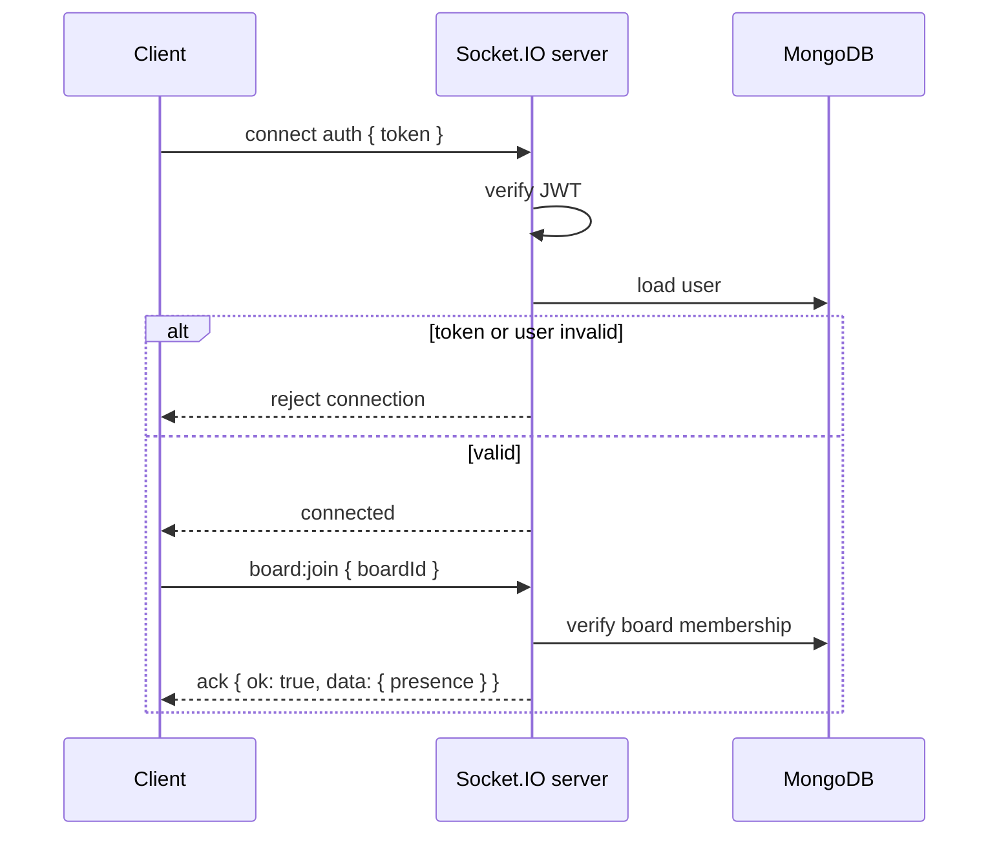

# 06 - Realtime Architecture

**Project:** CollabBoard
**Status:** Implemented foundation

This document explains how CollabBoard's Socket.IO layer works today. It is meant for future maintainers who need to add events, debug sync issues, or extend the board into multi-user project management.

---

## Goals

- Authenticate socket connections with the same JWT used by REST.
- Let clients join only board rooms they are members of.
- Persist every mutation before broadcasting it.
- Broadcast changes to the board room, excluding the sender.
- Keep REST and Socket.IO writes on the same service functions.
- Re-fetch board state after reconnect so the client can recover from missed events.

---

## Key Files

| File | Responsibility |
|---|---|
| `server/src/index.js` | Creates Express + HTTP server, attaches Socket.IO, configures CORS, calls `configureSockets(io)` |
| `server/src/socket.js` | JWT socket auth, `board:join`, presence tracking, card/list realtime events |
| `server/src/services/boardMutationService.js` | Shared card/list write logic used by both REST controllers and socket handlers |
| `server/src/controllers/cardController.js` | REST card endpoints, delegated to the shared mutation service |
| `server/src/controllers/listController.js` | REST list endpoints, delegated to the shared mutation service |
| `client/src/hooks/useSocket.js` | Socket.IO client lifecycle, ack-based emits, event subscription helper |
| `client/src/pages/BoardPage.jsx` | Joins board rooms, applies incoming events, emits local card/list mutations |

---

## Connection Flow



The server stores the authenticated user on `socket.data.user`. Joined board ids are stored in `socket.data.boardIds` so presence can be cleaned up on disconnect.

---

## Rooms

Each open board maps to a Socket.IO room:

```text
board:<boardId>
```

The client cannot join a room directly. It must emit `board:join`; the server verifies membership using `getBoardIfMember` before calling `socket.join(...)`.

---

## Ack Envelope

All mutation events use an ack callback.

Success:

```json
{
  "ok": true,
  "data": {}
}
```

Failure:

```json
{
  "ok": false,
  "error": {
    "code": "VALIDATION",
    "message": "Card title is required."
  }
}
```

The client helper `emitWithAck` rejects the Promise when:

- the socket is not connected
- the server times out
- the server returns `{ ok: false }`

---

## Event Contract

### Client to Server

| Event | Payload | Ack data |
|---|---|---|
| `board:join` | `{ boardId }` | `{ boardId, presence }` |
| `card:create` | `{ boardId, title, listId, position }` | `{ card }` |
| `card:update` | `{ boardId, cardId, updates }` | `{ card }` |
| `card:move` | `{ boardId, cardId, list, position }` | `{ card }` |
| `card:delete` | `{ boardId, cardId }` | `{ deleted: true }` |
| `list:create` | `{ boardId, title, position }` | `{ list }` |
| `list:update` | `{ boardId, listId, updates }` | `{ list }` |
| `list:move` | `{ boardId, listId, position }` | `{ list }` |
| `list:delete` | `{ boardId, listId }` | `{ deleted: true }` |

### Server to Client

| Event | Payload | Notes |
|---|---|---|
| `presence:update` | `{ boardId, users }` | throttled to avoid noisy connect/disconnect storms |
| `card:created` | `{ boardId, card }` | emitted after DB create |
| `card:updated` | `{ boardId, card }` | emitted after DB update |
| `card:moved` | `{ boardId, card }` | emitted after DB update |
| `card:deleted` | `{ boardId, cardId }` | emitted after DB delete |
| `list:created` | `{ boardId, list }` | emitted after DB create |
| `list:updated` | `{ boardId, list }` | emitted after DB update |
| `list:moved` | `{ boardId, list }` | emitted after DB update |
| `list:deleted` | `{ boardId, listId }` | emitted after DB delete |
| `board:error` | `{ code, message }` | emitted only when an event was sent without an ack callback |

Broadcasts use `socket.to(roomName(board._id)).emit(...)`, so the sender is excluded. The sender updates its own UI from the ack response.

---

## Persistence Rule

Every mutation follows this order:

1. Verify board membership.
2. Call the shared mutation service.
3. Wait for MongoDB persistence to succeed.
4. Ack the sender with the persisted document.
5. Broadcast the persisted document to the rest of the room.

If persistence fails, the server returns a negative ack and does not broadcast.

---

## Presence

Presence is stored in memory:

```text
boardId -> userId -> { user, sockets, lastSeen }
```

Why sockets are tracked per user:

- one user can open the same board in multiple tabs
- the user should remain present until their last tab disconnects

Presence broadcasts are throttled by board for 500ms. This avoids rapid event bursts when someone refreshes or opens multiple tabs.

Current limitation: presence is process-local. If the server runs multiple instances later, use a shared adapter/store such as Redis for Socket.IO rooms and presence state.

---

## Client Strategy

`BoardPage.jsx` uses socket-first writes:

1. If connected, emit the matching realtime mutation.
2. Use the ack response to update local state.
3. If disconnected, fall back to the REST endpoint.

Incoming events update local state only when the event belongs to the current `boardId`.

On reconnect, the board re-joins its room and re-fetches the full board snapshot. That keeps the UI correct even if events were missed while offline.

---

## Adding a New Realtime Mutation

1. Add or reuse a function in `server/src/services/boardMutationService.js`.
2. Add the REST controller path if the action should work without sockets.
3. Add a `registerMutation(...)` handler in `server/src/socket.js`.
4. Persist first, then broadcast the server-returned document.
5. Add a client helper or page handler that uses `emitWithAck`.
6. Add an incoming event listener in `BoardPage.jsx`.
7. Update this document and `docs/04-api-spec.md`.

---

## Known Follow-ups

- Enforce role-based permissions, not membership only, for REST and socket mutations.
- Add member endpoints and member management UI.
- Move presence to a shared adapter if the app runs more than one server instance.
- Add tests for REST/socket permission matrices and cross-board mutation attempts.
